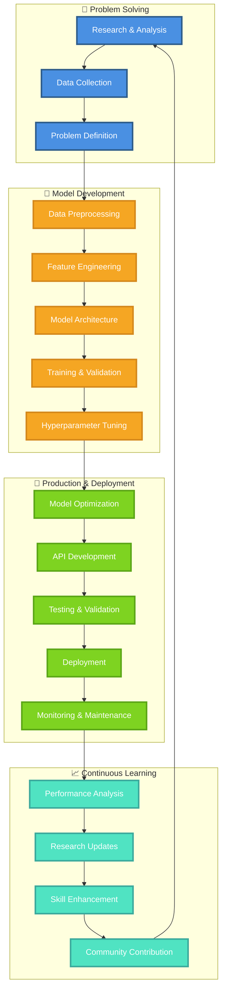
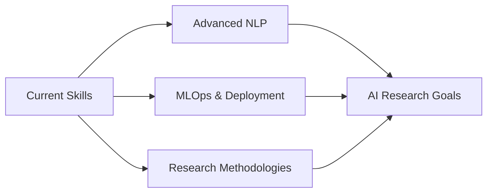

# Hi there, I'm Muhammad Umer Naseem 👋

<div align="center">
  
</div>

## 🚀 About Me

🎓 **Master's in Data Science** @ FAST-NUCES (In Progress)  
🔬 **Research Scholar** passionate about AI Engineering & Research  
🎯 **Goal:** Advancing AI/ML solutions for real-world impact  
📍 **Location:** Rawalpindi, Punjab, Pakistan

Currently exploring the frontiers of **Natural Language Processing**, **Computer Vision**, and **Deep Learning** while building practical AI solutions that make a difference.

## 💼 What I Do

<div align="center">
  
</div>

<div align="center">

### 🧠 My AI Development Ecosystem


</div> <details> <summary>🔍 <b>Click to explore my daily workflow</b></summary>
journey

```mermaid
    title My Daily AI Development Journey
    section Morning 🌅
      Read Research Papers     : 5: Me
      Review Latest AI Trends  : 4: Me
      Plan Daily Goals        : 5: Me
    section Development 💻
      Code & Experiment       : 5: Me
      Model Training          : 4: Me
      Debug & Optimize        : 3: Me
      API Development         : 5: Me
    section Analysis 📈
      Evaluate Results        : 4: Me
      Performance Metrics     : 5: Me
      Documentation          : 3: Me
    section Learning 🎓
      Study New Techniques    : 5: Me
      Community Engagement    : 4: Me
      Knowledge Sharing       : 5: Me
```
🏗️ My Tech Architecture

```mermaid
graph LR
    subgraph "🔍 Data Layer"
        A[Raw Data] --> B[Preprocessing]
        B --> C[Feature Store]
    end
    
    subgraph "🧠 Model Layer"
        D[Training Pipeline] --> E[Model Registry]
        E --> F[Validation Suite]
    end
    
    subgraph "🚀 Serving Layer"
        G[API Gateway] --> H[Model Serving]
        H --> I[Response Processing]
    end
    
    subgraph "📊 Monitoring Layer"
        J[Performance Metrics] --> K[Model Drift Detection]
        K --> L[Alerting System]
    end
    
    %% Data flow
    C --> D
    F --> G
    I --> J
    L --> A
    
    %% Styling with wisdom colors
    classDef dataLayer fill:#4A90E2,stroke:#2E5C8A,stroke-width:2px,color:#fff
    classDef modelLayer fill:#F5A623,stroke:#D4881C,stroke-width:2px,color:#fff
    classDef servingLayer fill:#7ED321,stroke:#5BA617,stroke-width:2px,color:#fff
    classDef monitoringLayer fill:#50E3C2,stroke:#3BA99C,stroke-width:2px,color:#fff
    
    class A,B,C dataLayer
    class D,E,F modelLayer
    class G,H,I servingLayer
    class J,K,L monitoringLayer
```


</details>

class AIEngineer:
    def __init__(self):
        self.name = "Muhammad Umer Naseem"
        self.role = "AI Engineer | Researcher"
        self.passion = ["Solving Real-World Problems", "Innovation", "Research"]
        self.last_updated = "2025-07-23"
        
    def daily_routine(self):
        return {
            "morning": "📚 Research latest AI papers & trends",
            "afternoon": "💻 Code, experiment & build models", 
            "evening": "🔬 Analyze results & optimize performance",
            "night": "📝 Document findings & plan tomorrow",
            "always": "🌟 Learning & pushing boundaries"
        }
    
    def tech_ecosystem(self):
        return {
            "core_languages": ["Python", "SQL"],
            "ml_powerhouse": ["TensorFlow", "PyTorch", "scikit-learn"],
            "api_frameworks": ["Flask", "FastAPI", "RESTful Design"],
            "data_engines": ["FAISS", "Vector DBs", "Pandas", "NumPy"],
            "deployment": ["Cloud APIs", "Model Serving", "MLOps"],
            "specializations": ["NLP", "Computer Vision", "Medical AI"]
        }
    
    def current_mission(self):
        return [
            "🏥 Advancing Medical AI for healthcare impact",
            "🔍 Building next-gen semantic search systems",
            "📊 Developing robust MLOps pipelines",
            "🧠 Contributing to AI research community",
            "🎓 Mastering advanced ML techniques"
        ]
    
    def vision_2025(self):
        return "🚀 Leading breakthrough AI research that transforms healthcare, education, and human understanding"
<div align="center">
🛠️ Tech Stack
<div align="center">
Languages & Frameworks
Python Flask FastAPI

ML/AI Technologies
TensorFlow PyTorch scikit-learn Pandas NumPy

Specializations
NLP Computer Vision Deep Learning

</div>
📊 GitHub Analytics
<div align="center">   </div> <div align="center">  </div>

🏆 Achievements & Certifications
🎖️ High Impact IT Training Program - Data Science, AI, and Blockchain (NAVTTC & NUST, 2024)
🎖️ Machine Learning with Python - IBM (2024)
🎖️ E-hunar Kamyab Jawan Program - ML, AI and Data Science (2023)
🎖️ Training Program in Data Science - NIIAIS (2023)
🎖️ Programming Essentials in Python - Virtual University (2023)

👥 Leadership & Community
🌟 Deputy Information Secretary - Computer Science Society FUUAST
🌟 Python Lead - Google Developer Student Club FUUAST

🎯 Research Focus Areas
Medical AI & Healthcare Applications
Semantic Search & Information Retrieval
Natural Language Processing
Computer Vision & Image Analysis
MLOps & Production Machine Learning
📈 Current Learning Journey


</div>
